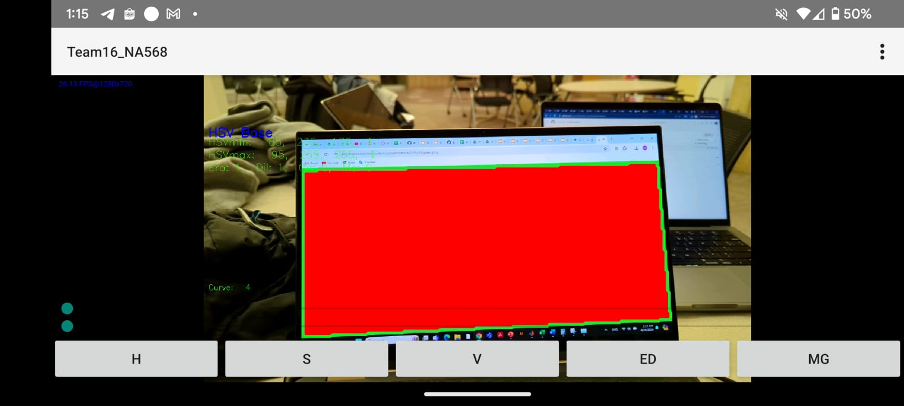

# EECS568 Team16, Winter 2024
 
## Pose Perfect - An Android Pose Estimation & Guiadance App

This project implements an Android application for pose estimation, designed to guide users towards capturing images from a specific angle.

### Features

* Uses computer vision techniques to identify target objects.
* Provides real-time feedback on user positioning for achieving the desired pose. It uses simple instructions: forward/backward right/left, up/down, and clockwise/counterclockwise

### Dependencies

This application requires the following libraries:

* OpenCV (version information)

### Usage

1. **Prerequisites:**
    * Ensure you have Java installed (version information) and an IDE configured for Java development.
    * Install OpenCV libraries following the official instructions ([https://opencv.org/](https://opencv.org/)).

2. **Running the Application:**
    * Clone or download the repository.
    * Open the project in your IDE and ensure all dependencies are properly linked.
    * Compile and run the application (specific instructions based on your IDE).

3. **Interaction:**
The app has three menus:
1. HSV Object Segmentation
2. Reference Input
3. Pose Perfrct Action
We will explaing the menus one by one.

1. HSV Object Segmentation
*(Describe this)

3. Reference Input
This is used to update the object dimensions, and manually input the desired reference image using the states (r, phi, theta, and psi). The default object size is 34.5 cm wide by 14.5 cm tall. Please change this according to your object.

4. Pose Perfect Action:
This part of the app guides the user on how to achieve the correct pose. The user can automatically 
    * (Describe how the user interacts with the application to achieve the desired pose estimation. 
     This might involve providing instructions on what the user sees on the screen and how their actions are interpreted by the application.)

### Code Breakdown

(Provide a brief overview of the code structure. Briefly mention the main functionalities of different packages or classes. This section is optional but can be helpful for developers who want to understand or extend the application.)

### License

This project is licensed under [License Name] (link to license file).

### Contributing

We welcome contributions to this project. Please refer to the CONTRIBUTING.md file for guidelines on how to contribute.

**Note:** You might need to add sections for:

* **Known Issues:** List any known bugs or limitations of the current implementation.
* **Authors:** Mention the developers who contributed to the project.

This is a basic template for your README file.  Adapt it to your specific application by adding details about the functionalities, user interaction steps, and code structure. 
